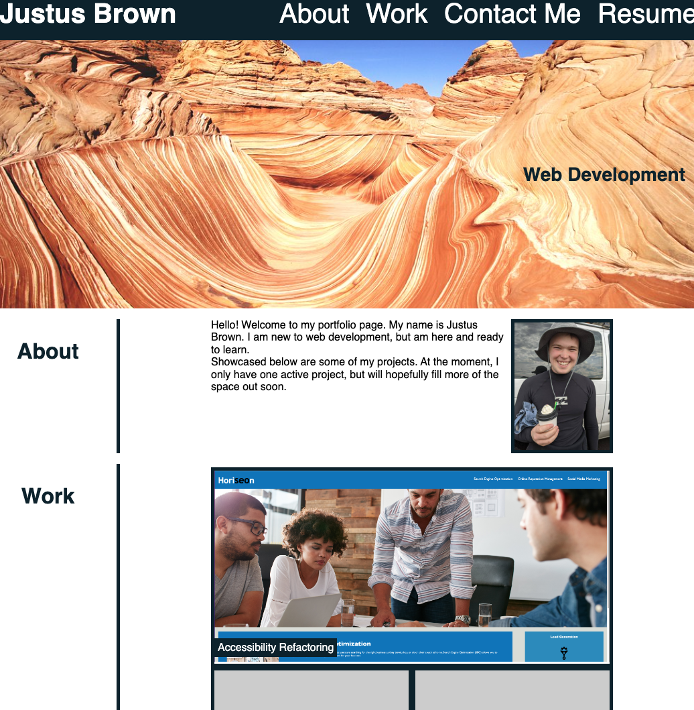

# 02 Advanced CSS: Portfolio

In this challenge, I created a portolio page from scratch to use as we progress through the quarter. I plan to fill it up with projects and to finalize the layout/styling at a later date.

To create this project, I used flexbox, media queries, CSS variables, and many other basic CSS tools that I have learned so far. My layout was required to be responsive to smaller screen sizes, needed to have working local links, and needed to link to my other projects.

You can view the deployed webpage here: https://github.com/brownj47/sample-portfolio-website

